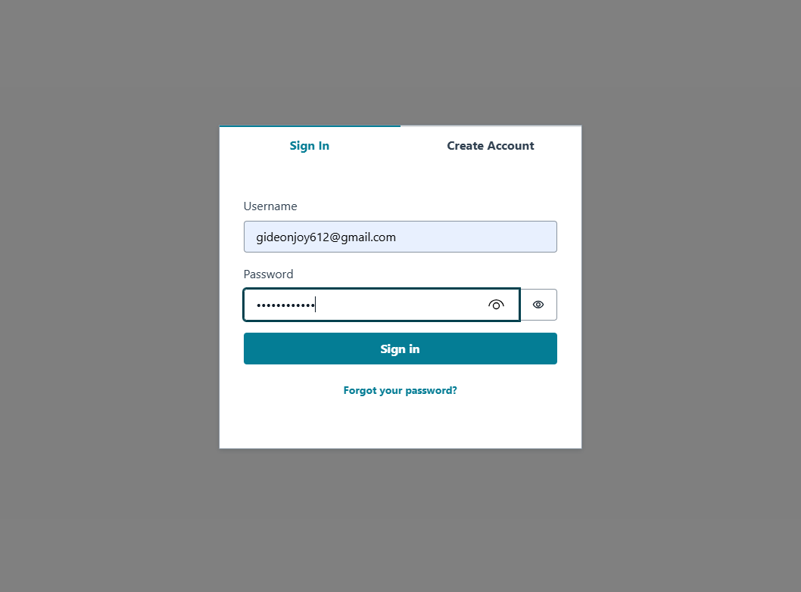
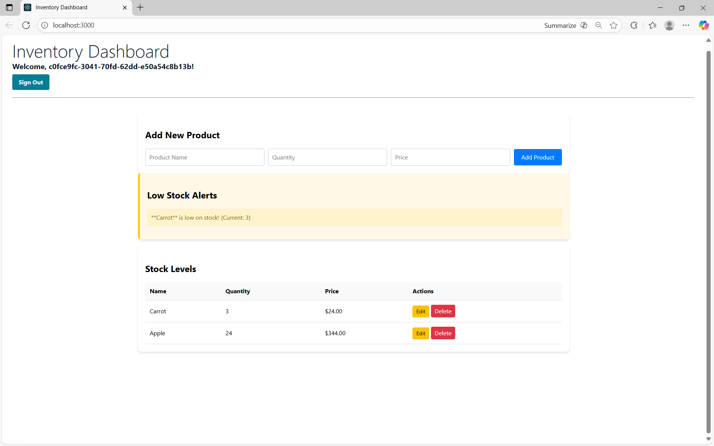
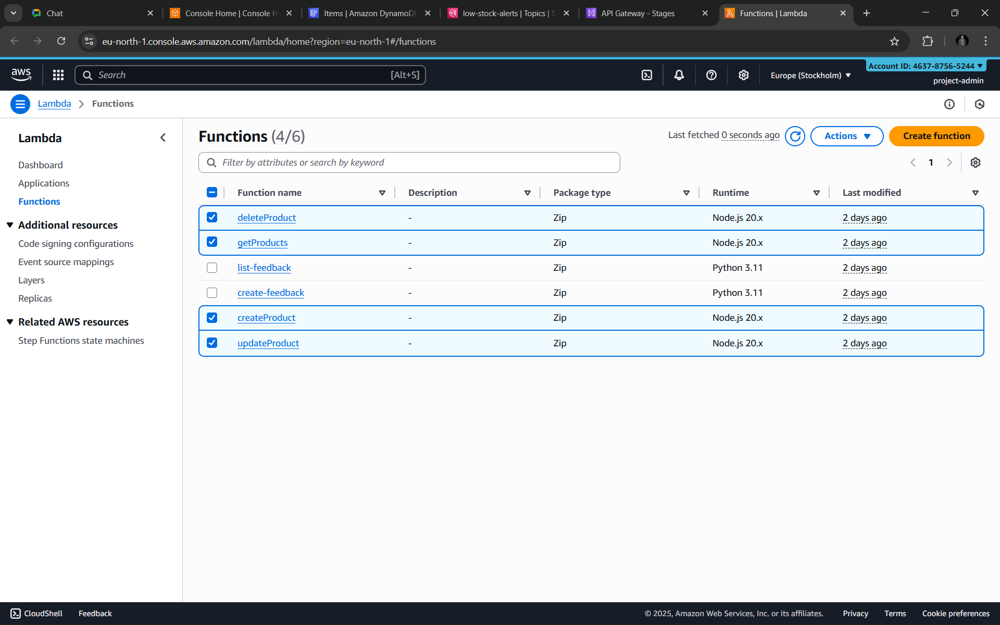
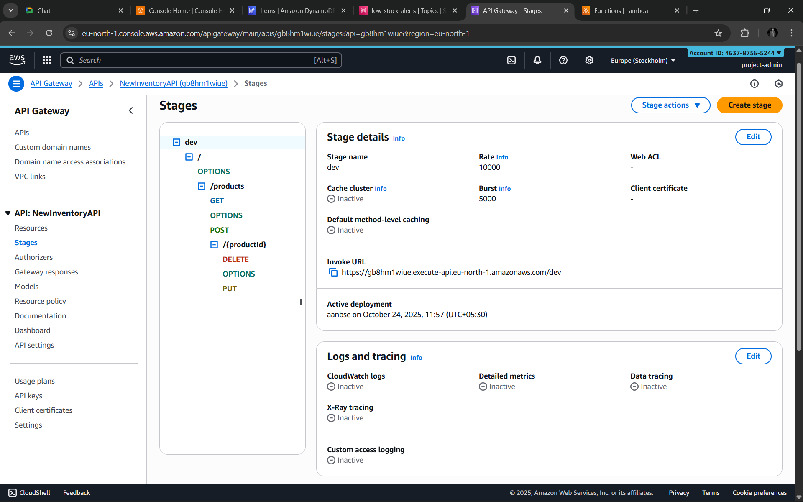
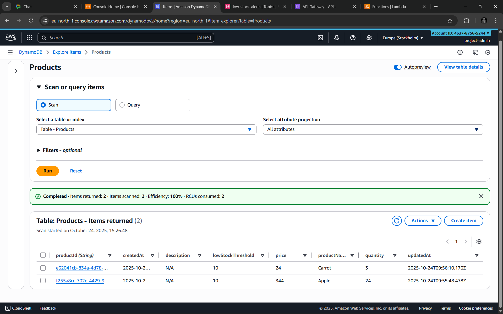
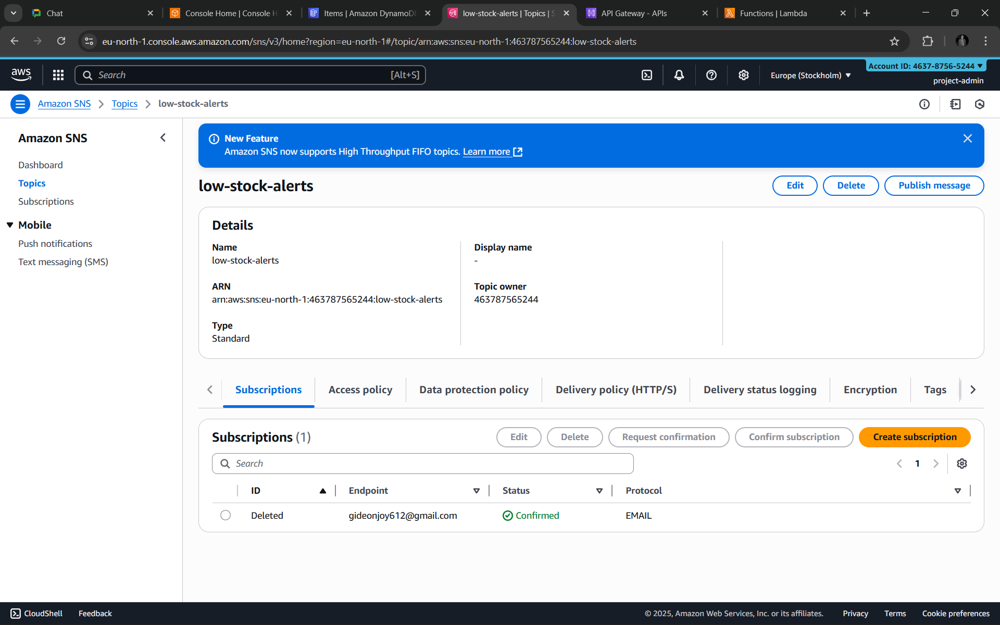
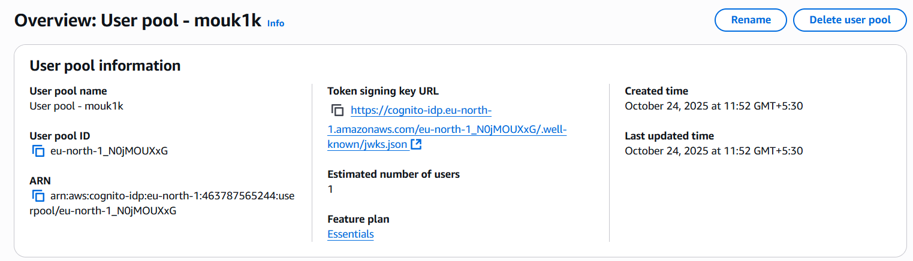
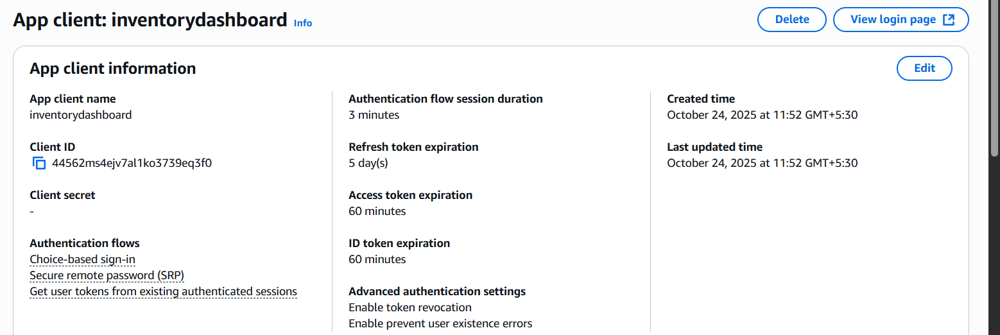

# ☁️ Cloud-based Inventory Management System for Local Businesses

### 🧑‍💻 Author: Budidha Gideon Joy  
**College:** TKR College of Engineering and Technology  
**Domain:** Cloud Computing and Serverless Architecture  
**Duration:** 9 Days Project

---

## 🏗️ Project Overview
This project implements a **serverless, cloud-native inventory management system** designed for small and medium-scale businesses.  
It provides real-time stock management, low-stock alerts, and centralized control using **AWS services** such as Lambda, DynamoDB, API Gateway, SNS, and Amplify.

---

## ⚙️ Architecture Overview

### 🔹 Application Flow
1. **Frontend:** React application hosted on **AWS Amplify**.  
2. **Authentication:** Managed by **Amazon Cognito** (sign-up, sign-in, secure access).  
3. **API Gateway:** Routes requests to AWS Lambda.  
4. **AWS Lambda:** Handles business logic (CRUD operations).  
5. **DynamoDB:** Stores product data in a scalable NoSQL table.  
6. **DynamoDB Stream + SNS:** Triggers alerts when inventory levels drop below a defined threshold.  
7. **Email Alerts:** Sent via **Amazon SNS** to subscribed users.

### 🧭 Architecture Diagram
```

```

---

## 🗂️ DynamoDB Schema

| Attribute | Type | Description |
|------------|------|-------------|
| **productId (PK)** | String | Unique identifier for each product |
| **productName** | String | Product name |
| **quantity** | Number | Current stock level |
| **price** | Number | Price per unit |
| **description** | String | Description of the product |
| **lowStockThreshold** | Number | Alert threshold quantity |

---
## 📸 AWS Resource Validation Figures

The following figures validate the deployment of the serverless backend components in the `eu-north-1` (Stockholm) region.

### Figure 1: Live Inventory Dashboard and Alerts


The application is running locally, successfully fetching data and displaying a low stock alert for 'Carrot'.

### Figure 2: AWS Lambda Functions


The five core Node.js Lambda functions responsible for the API's CRUD operations are deployed and ready.
- `deleteProduct`, `getProducts`, `createProduct`, `updateProduct`. (The `lowStockAlert` Lambda is triggered by the DynamoDB stream).

### Figure 3: API Gateway Stages and Resources


The `NewInventoryAPI` is deployed to the `dev` stage, routing requests to the respective Lambda functions (GET, POST, PUT, DELETE).

### Figure 4: DynamoDB Products Table


The DynamoDB table is online and contains the current inventory items ('Carrot', 'Apple') with their attributes (`productId`, `quantity`, `lowStockThreshold`, etc.).

### Figure 5: Amazon SNS Subscription Status



The email alert system is confirmed and ready. The subscription for `gideonjoy612@gmail.com` is active and confirmed.

### Figure 6: Cognito User Pool and Client




Authentication is secured via Cognito. The User Pool ID (`eu-north-1_N0jMOUXxG`) and the associated App Client are active.

## 🚀 Features
- ✅ CRUD Operations for products  
- 🔒 Secure authentication with Cognito  
- 📊 Real-time inventory updates  
- 📧 Automated low-stock email alerts  
- 💡 Scalable, serverless AWS architecture  
- 🌐 Frontend hosted on AWS Amplify

---

## 🧠 Business Use Cases

### 🏪 Shop Size 1: Local Business
- **Profile:** Single-location boutique, café, or retail shop.  
- **Need:** Low-cost solution with automatic alerts.  
- **Value:** Operates mostly in AWS Free Tier — nearly zero cost when idle.

### 🏬 Shop Size 2: Medium Business
- **Profile:** Multi-location chain or restaurant group.  
- **Need:** Centralized system and analytics.  
- **Value:** Unified inventory data, scalability, and optional integration with **Amazon QuickSight**.

### 🏭 Shop Size 3: Large E-commerce Retailer
- **Profile:** High-traffic e-commerce platform.  
- **Need:** Reliable and fast API-driven backend.  
- **Value:** Low latency, event-driven architecture, and data integration with **Amazon Redshift** for analytics.

---

## 🔔 Alerting Workflow (Event-Driven)

1. Product quantity update triggers **DynamoDB Stream event**.  
2. Event invokes **lowStockAlert Lambda function**.  
3. Lambda checks `quantity < lowStockThreshold`.  
4. If true → Publishes alert to **Amazon SNS** topic.  
5. SNS sends an **email notification** to subscribed users.

---

## 🧩 AWS Services Used
| Service | Purpose |
|----------|----------|
| **AWS Lambda** | Executes backend logic without managing servers |
| **Amazon API Gateway** | Handles REST API endpoints |
| **Amazon DynamoDB** | NoSQL database for products |
| **AWS Amplify** | Hosts the React frontend |
| **Amazon Cognito** | User authentication and access control |
| **Amazon SNS** | Sends stock alert notifications |
| **DynamoDB Streams** | Triggers alerts and enables event-driven flows |

---

## 🧱 Tech Stack
- **Frontend:** React.js (AWS Amplify Hosting)  
- **Backend:** AWS Lambda (Node.js)  
- **Database:** Amazon DynamoDB  
- **Authentication:** Amazon Cognito  
- **Alerting:** Amazon SNS  
- **Version Control:** GitHub

---

## 🧾 Future Enhancements
- Add **AWS QuickSight** integration for sales analytics dashboards.  
- Implement **multi-user role management** (Admin/Staff).  
- Integrate **barcode scanning** for faster stock updates.  
- Add **mobile-friendly PWA interface** for shop owners.  

---

## 🏁 Conclusion
This project showcases how AWS serverless architecture can empower small businesses with enterprise-level capabilities.  
It minimizes cost, reduces maintenance, and provides automated alerts to prevent stock shortages — a scalable solution for modern retail management.

---

### 📧 Contact
**Budidha Gideon Joy**  
*TKR College of Engineering and Technology*  
📍 Hyderabad, India  
✉️ gideonjoy612@gmail.com  
